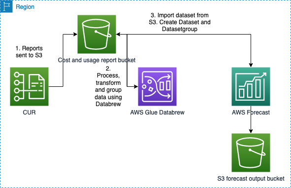

# Forecast AWS cost and usage using Forecast and Databrew with CDK version 2 in TypeScript

This is a cost and usage report forcast project for TypeScript development with CDK.

The `cdk.json` file tells the CDK Toolkit how to execute your app.

## Useful commands

 * `npm run build`   compile typescript to js
 * `npm run watch`   watch for changes and compile
 * `npm run test`    perform the jest unit tests
 * `cdk deploy`      deploy this stack to your default AWS account/region
 * `cdk diff`        compare deployed stack with current state
 * `cdk synth`       emits the synthesized CloudFormation template
 * `npm run format`  format the code according to the prettier settings

## Forecast Costs architectural diagram

